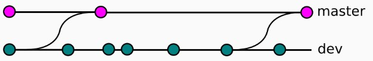
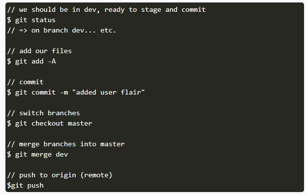
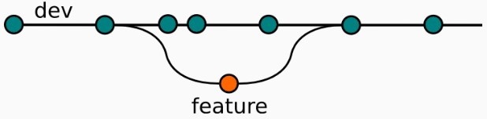
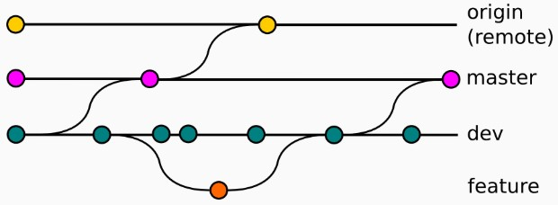

# Git Workflow: Single Developer

Untuk melakukan development secara solo, workflow dibagi menjadi 3 bagian utama:
* Master dan origin (remote)
* Development
* Feature

Branch master dan origin merepresentasikan repositori kode publik. Branch tersebut berisi source code dari file aplikasi. Sedangkan development branch adalah dimana kita melakukan sebagian besar pekerjaan, dan juga merupakan asal dari banyak commit kita. Setelah perubahan disiapkan, kita menambahkan file, commit, dan akhirnya menggabungkan (merge) perubahan ke branch master dan push ke remote:

****

berikut ini adalah tampilan di console:

****

branch feature merepresentasikan penambahan major dalam project, seperti revamp dari CSS suatu situs atau penambahan fungsi pada aplikasi. Branch feature dibuat dari branch development tama untuk melakukan maintenance diluar pekerjaan pada fitur itu sendiri. Bekerja pada suatu fitur membutuhkan checkout pada branch yang tepat. Apabila kita ingin pindah ke branch development untuk maintenance, kita dapat commit dan langsung berpindah.

****

Berikut ini adalah gambaran proses dimana semua segmen dikombinasikan

****

# Git Workflow: Team Developer

Ketika mengevaluasi workflow pada tim, hal palinng penting adalah mempertimbangkan sifat tim. Kita ingin workflow meningkatkan efektifitas dan tidak membebani sehingga membatasi produktivitas. Beberapa hal untuk dipertimbangkan ketika mengevaluasi git workflow adalah:
* kesesuaian workflow dengan skala besarnya tim
* kemudahan memperbaiki kesalahan dan error pada workflow
* apakah workflow menambahkan cognitive overhead pada tim

## Centralized Workflow
adalah workflow yang bagus untuk tim transisi dari SVN. Seperti subversion, Centralized Workflow menggunakan repositori sentral yang berperan sebagai pintu masuk tunggal untuk semua perubahan pada proyek. Development branch disebut master dan semua perubahan di-commit-kan pada branch ini. Workflow ini tidak membutuhkan branch lain selain master.

gambar5

## Membuat Central Repository
Pertama, seseorang harus membuat repositori sentral pada server. Apabila project baru, maka dapat membuat repository kosong, bila tidak harus mengimport Git atau SVN repository yang sudah ada. Central repository harus selalu merupakan repository yang tidak memiliki working directory, yang bisa dibuat dengan:

  ssh user@host git init --bare /path/to/repo.git
